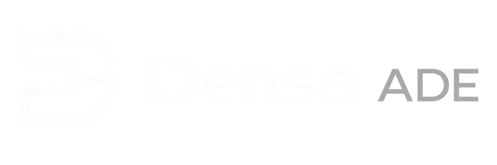

# Densa ADE

Densa ADE is an agentic development environment developed by Densa Labs where coding agents can plan, build, test, and iterate on software autonomously.

## Installation

_TODO: fill in when initial development is finished_

## Why Densa?

Densa ADE **understands your project**, creates a **development roadmap**, calls Codex **using your subscription**, and continues until the **task is finished**.

**Limits hit?** Densa will automatically continue when they reset.

**Worried about your Mac sleeping?** Densa will keep your Mac awake until your agents are done.

**The choice between full autonomous execution and guided development remains yours.**

## Disclaimer

Densa ADE is an experimental project _currently under development_.
AI agents can make mistakes, including modifying or deleting code. We recommend using version control/backups and reviewing important changes.

Densa ADE has validation and recovery systems, but users **should not rely on them** as a guarantee of safety. These systems **do not make autonomous execution perfectly safe**. Authenticated third-party coding agents are subject to their own terms, policies, and limits.

## License

Densa Labs' original Densa ADE code is licensed under the **Apache License, Version 2.0**.
See [`LICENSE`](LICENSE).

Densa ADE is a thin fork of Code - OSS (`microsoft/vscode`). Original Code - OSS code
remains under Microsoft's **MIT License**, and every modified Code - OSS file retains
Microsoft's MIT notice. See
[`THIRD_PARTY_NOTICES.md`](THIRD_PARTY_NOTICES.md) and [`code-oss/`](code-oss/).

For technical documentation, see [`/docs`](docs/).
